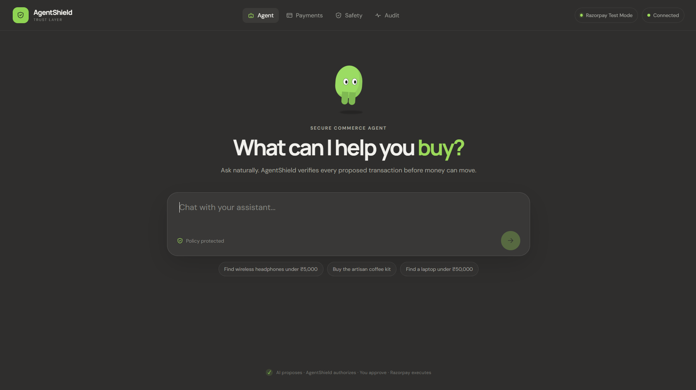

<p align="center">
  
</p>

<h1 align="center">AgentShield</h1>

<p align="center">
  <strong>Trust &amp; Reliability Layer for Agentic Commerce</strong>
</p>

<p align="center">
  AI can propose. Deterministic systems authorize. Razorpay executes.
</p>

<p align="center">
  <a href="#demo">Demo</a> •
  <a href="#why-agentshield">Why AgentShield?</a> •
  <a href="#how-it-works">How It Works</a> •
  <a href="#key-features">Key Features</a> •
  <a href="#getting-started">Getting Started</a> •
  <a href="#api">API</a> •
  <a href="./CONTRIBUTING.md">Contributing</a>
</p>

---

## Built for Razorpay AI Builder 2026

**Track:** AI Growth & Agentic Commerce

AgentShield is an open-source safety and reliability layer for AI-powered commerce. It sits between an AI agent and payment execution, ensuring that an agent can **recommend and propose actions without getting unrestricted authority to move money**.

- The agent **proposes**.
- AgentShield **decides**.
- The customer **approves**.
- Razorpay **executes**.

---

## Demo

<p align="center">
  <a href="https://youtu.be/rWPqCKrf7cY">
    
  </a>
</p>

<p align="center">
  <strong>▶ Watch the AgentShield Demo</strong>
</p>

The demo walks through the complete AgentShield flow end to end:

**Customer → AI Agent → Policy Validation → Human Approval → Razorpay Test Payment → Reconciliation → Audit Trail**

---

## Why AgentShield?

AI agents are becoming capable of taking real actions — including purchasing products, applying discounts, creating orders, and initiating payments.

The problem is simple:

> **Should an AI agent be trusted with unrestricted financial authority?**

AgentShield introduces a deterministic control layer between **AI decision-making** and **financial execution**. Instead of letting an AI model directly trigger a payment, every proposed action passes through an independent policy engine before a human ever sees an approval prompt.

```text
AI Agent
   ↓
Action Proposal
   ↓
AgentShield Policy Engine
   ↓
ALLOW / BLOCK / REVIEW
   ↓
Human Approval
   ↓
Razorpay Test Mode
```

This separates reasoning from authorization.

### What AgentShield protects against

AgentShield validates every proposed financial action against deterministic rules, including:

- 💰 Maximum transaction limits
- 📦 Product availability
- 🏷️ Discount validation
- 🔐 Permission requirements
- 👤 Human approval requirements
- 🔁 Duplicate payment protection
- 🧾 Server-authoritative order totals
- 🔄 Payment reconciliation
- 📋 Complete audit history

The AI does not get to override these checks.

---

## How It Works

```text
┌──────────────┐
│   Customer   │
└──────┬───────┘
       ↓
┌──────────────┐
│   AI Agent   │
└──────┬───────┘
       ↓
┌─────────────────────┐
│   Action Proposal    │
└──────────┬───────────┘
           ↓
┌───────────────────────┐
│      AgentShield      │
│  Policy Validation    │
└──────────┬─────────────┘
           ↓
      ALLOW / BLOCK
           ↓
┌───────────────────────┐
│    Human Approval     │
└──────────┬─────────────┘
           ↓
┌───────────────────────┐
│   Razorpay Test Mode  │
└──────────┬─────────────┘
           ↓
┌───────────────────────┐
│ Webhook / Recovery &  │
│    Reconciliation     │
└──────────┬─────────────┘
           ↓
┌───────────────────────┐
│     Audit Trail       │
└───────────────────────┘
```

### Example agent flow

```text
Customer:   "Recommend something for my morning coffee."
                            ↓
AI Agent:   Recommends a product and proposes an action.
                            ↓
AgentShield: Validates price, inventory, policy limits,
             discounts, and approval requirements.
                            ↓
AgentShield: ALLOW
                            ↓
Human:      Approves the payment.
                            ↓
Razorpay:   Payment Link created.
                            ↓
Customer:   Completes payment in Razorpay Test Mode.
                            ↓
AgentShield: Reconciles payment state.
                            ↓
Audit:      Records the complete action history.
```

---

## Key Features

### 🤖 AI-Powered Commerce
The AI agent can:
- Understand customer requests
- Search the product catalog
- Recommend products and suggest cross-sells
- Generate structured action proposals

### 🛡️ Deterministic Policy Enforcement
AgentShield independently validates every proposed financial action against:
- Price
- Inventory
- Transaction limits
- Discounts
- Permissions
- Approval requirements
- Duplicate actions

### ✋ Human Approval Gate
Financial actions requiring approval cannot bypass the approval step. The AI proposes the action, a human explicitly authorizes it, and only then can payment execution proceed.

### 💳 Razorpay Test Mode
Approved actions can create Razorpay Payment Links in Test Mode. AgentShield never trusts the AI-generated amount as the final financial authority — the server verifies the authoritative order state before creating the payment.

### 🔄 Payment Reconciliation
Payment state is reconciled against Razorpay so that redirect failures, delayed webhooks, or uncertain payment states do not silently produce incorrect local state.

### 📋 Audit Trail
Every important event is recorded throughout the lifecycle:

```text
Action Proposed → Action Validated → Action Approved →
Payment Created → Payment Updated → Payment Reconciled
```

This makes the system inspectable and debuggable.

---

## Tech Stack

| Layer      | Technology                  |
|------------|------------------------------|
| Frontend   | React + TypeScript           |
| Backend    | Node.js + Express + TypeScript |
| Database   | MongoDB + Mongoose           |
| AI         | LLM API                      |
| Payments   | Razorpay Test APIs           |
| Build Tool | Vite                          |
| Runtime    | Node.js                       |

---

## Project Structure

```text
AgentShield/
│
├── client/                 # React frontend
├── server/                 # Express + TypeScript backend
├── AGENTSHIELD_SRS.md      # Software requirements specification
├── README.md
├── CONTRIBUTING.md
└── assets/
    ├── logo.png
    └── demo.mp4
```

---

## Getting Started

### Prerequisites

- Node.js 18+
- npm
- MongoDB / MongoDB Atlas
- Razorpay Test Mode credentials
- An LLM API key

### 1. Clone the repository

```bash
git clone https://github.com/bhaveshdesale/AgentShield.git
cd AgentShield
```

### 2. Install backend dependencies

```bash
cd server
npm install
```

Create a `.env` file in `server/` with your local configuration:

```env
PORT=5050
MONGODB_URI=your_mongodb_connection_string

OPENAI_API_KEY=your_llm_api_key

RAZORPAY_KEY_ID=your_razorpay_test_key_id
RAZORPAY_KEY_SECRET=your_razorpay_test_key_secret
```

> ⚠️ Never commit `.env` files or API credentials to the repository.

### 3. Seed the database

```bash
npm run seed
```

### 4. Start the backend

```bash
npm run dev
```

The API will run on:

```text
http://localhost:5050
```

Health check:

```http
GET /api/health
```

### 5. Start the frontend

Open another terminal:

```bash
cd client
npm install
npm run dev
```

The frontend will run on:

```text
http://localhost:5173
```

Open that URL in your browser.

---

## Safety Model

The central design principle is:

> **AI proposes. Deterministic systems authorize.**

AgentShield intentionally keeps financial authorization outside the LLM. The model can produce an action proposal, but it cannot:

- Change server-side policy
- Override transaction limits
- Modify authoritative order totals
- Bypass required approval
- Mark a payment as successful without verification

This creates a clear boundary between AI reasoning and financial execution.

---

## API

The backend exposes the application flow through the following endpoints:

```http
POST   /api/agent/chat

GET    /api/products
GET    /api/products/:id

POST   /api/actions/validate
POST   /api/actions/approve

POST   /api/payments/create
GET    /api/payments
GET    /api/payments/:id/status

POST   /api/webhooks/razorpay

GET    /api/audit
GET    /api/dashboard/stats

POST   /api/simulation/run

GET    /api/health
```

---

## Testing

Backend tests:

```bash
cd server
npm test
npm run typecheck
```

Frontend type checking:

```bash
cd client
npm run typecheck
```

Production frontend build:

```bash
cd client
npm run build
```

---

## Hackathon Context

AgentShield was built for the **Razorpay AI Builder Internship 2026** challenge, under the **AI Growth & Agentic Commerce** track.

The project explores a practical question for the next generation of AI-powered commerce:

> How do we allow AI agents to participate in transactions without giving them unrestricted financial authority?

AgentShield approaches this through policy enforcement, explicit approval, payment verification, reconciliation, and auditability.

---

## Scope

### Included
- AI-assisted product discovery
- Structured action proposals
- Deterministic policy validation
- Human approval
- Razorpay Test Mode payments
- Payment reconciliation
- Audit logging
- Simulation scenarios
- Commerce dashboard

### Intentionally out of scope
- Production payment processing
- User authentication system
- Multi-tenant infrastructure
- Automated refunds
- Payouts
- Subscriptions
- WhatsApp / voice integrations
- Custom fraud ML
- Kubernetes / microservice infrastructure

The goal is to keep the prototype focused on the trust boundary between AI agents and financial execution.

---

## Roadmap

- [x] AI agent interaction
- [x] Product recommendations
- [x] Structured action proposals
- [x] Deterministic policy validation
- [x] Human approval gate
- [x] Razorpay Test Mode integration
- [x] Payment status reconciliation
- [x] Audit trail
- [x] Payment history
- [x] Simulation scenarios
- [ ] Public hosted demo
- [ ] Expanded policy configuration
- [ ] More agentic-commerce integrations

---

## Contributing

See [CONTRIBUTING.md](./CONTRIBUTING.md) for how to propose changes, report bugs, and submit pull requests.

---

## Security

Please never commit:

- API keys
- Razorpay secrets
- Database credentials
- `.env` files
- Access tokens
- Private credentials

If you discover a security issue, please report it privately rather than publicly exposing credentials or exploit details.

---

## Status

🚧 **Hackathon / Active Development**

AgentShield is currently a working prototype demonstrating the trust and reliability layer for agentic commerce. Razorpay integration currently uses **Test Mode**.

---

## License

License information will be added as the project is prepared for broader open-source distribution.

---

## Acknowledgements

Built for the **Razorpay AI Builder 2026** challenge. Inspired by the broader movement toward safer, more reliable, and accountable AI agents operating in real-world commerce.

<p align="center">
  <strong>AgentShield</strong>
  <br />
  Trust before transaction.
</p>
